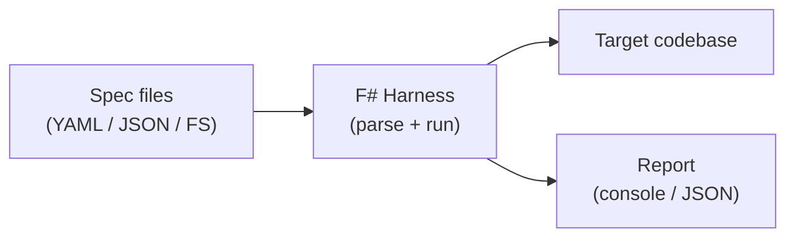

# PRD: Spec-Driven Development Test Harness

**Status:** Draft  
**Author:** —  
**Last updated:** 2026-06-06  
**Source idea:** [thoughts.md](./thoughts.md)

---

## 1. Executive Summary

Build a **reference test harness** that demonstrates **spec-driven development (SDD)** end to end: human- or machine-readable specifications define expected behavior, and an automated harness verifies that a target codebase satisfies those specs.

The harness will be implemented primarily in **F#**, chosen for strong typing, expressive domain modeling, and first-class support for property-based and example-based testing. The project serves as both a **working example** and a **reusable pattern** that teams can adapt when adopting SDD on real codebases.

---

## 2. Problem Statement

Teams often write tests after implementation, or tests drift from intent because requirements live in tickets, comments, or developers' heads. Spec-driven development inverts this: **the spec is the contract**, and code plus tests must prove conformance.

Today there is no small, opinionated example in this repository that shows:

- How to structure specs so they are executable
- How to connect specs to a real (or sample) codebase
- How to run conformance checks in CI and locally with clear pass/fail semantics

Without that example, adopting SDD feels abstract and hard to bootstrap.

---

## 3. Goals

| ID | Goal |
|----|------|
| G1 | Provide a **minimal but complete** SDD workflow: write spec → run harness → see structured results |
| G2 | Implement the harness in **F#** where it adds value (parsing, validation, reporting, test orchestration) |
| G3 | Make specs **human-readable** and **machine-verifiable** (not only unit tests buried in app code) |
| G4 | Produce **actionable failure output** (which spec, which assertion, expected vs actual) |
| G5 | Serve as documentation-by-example for future codebase-explainer work |

---

## 4. Non-Goals (v1)

- Building a full production codebase explainer or static analyzer
- Supporting every language ecosystem in v1 (start with one target language/stack)
- Replacing existing test frameworks (the harness **complements** them)
- AI-generated specs or auto-remediation of failing code
- A hosted SaaS or web UI (CLI-first)

---

## 5. Target Users

| Persona | Need |
|---------|------|
| **Developer learning SDD** | A copy-pasteable pattern with clear folder layout and one happy-path + one failure-path example |
| **Tech lead** | A lightweight conformance gate they can run in CI before merge |
| **Future codebase-explainer work** | A spec schema and runner that can later ingest larger repos |

---

## 6. User Stories

### P0 — Must have

1. **As a developer**, I can write a spec file that describes expected behavior (e.g., API shape, module exports, invariants) so that intent is explicit before or alongside implementation.

2. **As a developer**, I can run a single CLI command (e.g., `dotnet run --project Harness`) and get a summary: total specs, passed, failed, skipped.

3. **As a developer**, when a spec fails, I see which clause failed, the expected value, and the observed value (or a clear error message).

4. **As a developer**, I can point the harness at a **sample target codebase** (or fixture) and verify at least one real conformance check end to end.

5. **As a CI maintainer**, I can run the harness non-interactively and rely on a non-zero exit code on failure.

### P1 — Should have

6. **As a developer**, I can organize specs by feature or module (e.g., `specs/users.spec.json`, `specs/routes.spec.fs`).

7. **As a developer**, I can add a new spec type (e.g., “route exists”, “function signature matches”) without rewriting the entire runner.

8. **As a developer**, I get a JSON or JUnit report for CI dashboards.

### P2 — Nice to have

9. **As a developer**, I can run property-based checks (FsCheck) for invariants declared in specs.

10. **As a developer**, I can diff spec versions to see what behavior changed between releases.

---

## 7. Proposed Solution

### 7.1 High-level architecture



**Components:**

| Component | Responsibility | Language |
|-----------|----------------|----------|
| `Spec` | Schema/types for declarative expectations | F# |
| `SpecLoader` | Load and validate spec files from `specs/` | F# |
| `Adapters` | Read target codebase (files, AST, HTTP, CLI) | F# (+ optional scripts) |
| `Matchers` | Compare spec expectations to observed reality | F# |
| `Runner` | Orchestrate execution, parallelism, exit codes | F# |
| `Reporter` | Human and machine-readable output | F# |

### 7.2 Spec-driven workflow

1. **Define** — Author writes or updates a spec describing desired behavior.
2. **Implement** — Application code is written or changed to satisfy the spec.
3. **Verify** — Harness runs matchers; failures block merge if CI is configured.
4. **Evolve** — Specs are versioned with code; changes to behavior require spec updates.

### 7.3 Example spec categories (v1)

Start with a small, orthogonal set so the example stays understandable:

| Category | Example expectation |
|----------|---------------------|
| **File layout** | Required paths exist (`src/`, `README.md`) |
| **Public API surface** | Named module/type/function exists with expected signature |
| **HTTP contract** | `GET /health` returns 200 and body contains `"ok"` |
| **Documentation** | Listed public APIs appear in generated or hand-written docs |

Exact categories depend on the sample target chosen in §8.

### 7.4 Why F#

- **Algebraic types** model spec clauses and results without ambiguity.
- **Railway-oriented composition** (`Result`) fits parse → validate → execute pipelines.
- **FsCheck** enables optional property tests from the same spec metadata.
- **.NET SDK** gives cross-platform CLI and CI integration with minimal tooling.

Use F# for the harness core. Target code under test may be in any language; adapters bridge the gap.

---

## 8. Sample Target Codebase

The harness needs a **fixed target** for the worked example. Options:

| Option | Pros | Cons |
|--------|------|------|
| **A. Small F# library** | Single toolchain, simplest adapters | Less “explainer” flavor |
| **B. Minimal HTTP service (any stack)** | Clear contract testing story | Extra runtime deps |
| **C. Existing repo submodule** | Realistic | Higher setup cost |

**Recommendation for v1:** Option **A** — a tiny F# library (`BillingApp`) with 2–3 functions plus one HTTP handler if needed. Keeps the example self-contained while leaving room to add Option B/C later for “codebase explainer” scenarios.

---

## 9. Functional Requirements

### FR-1 Spec format

- Specs live under `specs/` at repo root.
- v1 format: **JSON** or **YAML** with a documented JSON Schema (F# types mirror the schema).
- Each spec has: `id`, `description`, `category`, `target`, `assertion`, optional `tags`.

### FR-2 CLI

- Commands: `run` (default), `validate` (spec syntax only), `list` (show registered specs).
- Flags: `--spec <path>`, `--format json|text`, `--fail-fast`.

### FR-3 Execution

- Runner executes all specs unless filtered.
- Failed spec does not crash the runner; all results are collected.
- Exit code `0` if all pass; `1` if any fail; `2` for harness/spec parse errors.

### FR-4 Reporting

- Text: colored or plain summary table (spec id, status, duration, message).
- JSON: array of `{ id, status, message, expected, actual, durationMs }`.

### FR-5 Extensibility

- Matchers registered by `category` string (plugin-style registry in F#, not dynamic DLL loading in v1).

---

## 10. Non-Functional Requirements

| ID | Requirement |
|----|-------------|
| NFR-1 | Full `run` on sample target completes in **< 5 seconds** on a typical laptop |
| NFR-2 | No network required for default example |
| NFR-3 | Works on **macOS** and **Linux** with .NET 8+ |
| NFR-4 | MIT or repo-default license; no secrets in specs or fixtures |
| NFR-5 | README documents the SDD loop in **< 10 minutes** read time |

---

## 11. Repository Layout (proposed)

```
codebase-explainer.fsharp/
├── docs/
│   ├── thoughts.md
│   └── spec-driven-dev-test-harness.md   # this PRD
├── specs/
│   └── *.yaml                              # declarative specs
├── src/
│   ├── Harness/                            # F# runner, loaders, reporters
│   └── BillingApp/                          # minimal target under test
├── tests/
│   └── Harness.Tests/                      # unit tests for the harness itself
├── README.md
└── codebase-explainer.sln
```

---

## 12. Success Metrics

| Metric | Target (v1) |
|--------|----------------|
| End-to-end example runs locally | 100% success on clean clone |
| Spec categories demonstrated | ≥ 3 |
| Harness self-test coverage | Core loaders + 1 matcher per category |
| Time to first green run (new developer) | ≤ 15 minutes following README |
| CI job | Single job, deterministic, no flakes |

---

## 13. Milestones

### M1 — Skeleton (week 1)

- Solution structure, `Spec` types, JSON/YAML loader, `validate` command
- One hard-coded matcher and fixture spec
- README “quick start”

### M2 — Runnable example (week 2)

- `BillingApp` with deliberate pass and fail scenarios
- `run` command with text report and exit codes
- Harness unit tests

### M3 — SDD story complete (week 3)

- ≥ 3 spec categories, JSON report, `--fail-fast`
- CI workflow (GitHub Actions or equivalent)
- Document the spec → implement → verify loop in README

### M4 — Explainer hook (optional)

- Adapter interface documented for pointing at external repos
- One additional target (e.g., subdirectory or HTTP app) proved by a single spec

---

## 14. Risks and Mitigations

| Risk | Mitigation |
|------|------------|
| Spec format churn | Version field in each spec; schema tests in `Harness.Tests` |
| Over-scoping matchers | Fixed v1 category list; extensibility via registry only |
| F# unfamiliarity for readers | Heavy README examples; minimal magic |
| Flaky integration checks | Prefer filesystem and compile-time checks over live servers in v1 |

---

## 15. Open Questions

1. **Spec authoring format** — JSON vs YAML vs F# DSL for specs? (JSON Schema + YAML recommended for v1 readability.)
2. **Target codebase** — Confirm Option A (small F# lib) vs embedding an external sample.
3. **Relationship to “codebase explainer”** — Is v1 only the harness, or must it also generate human-facing explanations from specs?
4. **CI platform** — GitHub Actions assumed unless specified otherwise.
5. **Property-based specs** — In scope for v1 (P1) or deferred to v2?

---

## 16. Acceptance Criteria (v1 done)

- [ ] `dotnet run --project src/Harness -- run` executes all specs against `BillingApp`
- [ ] At least one spec intentionally fails in a demo fixture with clear expected/actual output
- [ ] `dotnet test` passes for `Harness.Tests`
- [ ] README explains SDD workflow with spec snippet + command output
- [ ] CI runs harness and fails the build when a spec fails
- [ ] This PRD’s open questions in §15 are resolved or tracked as issues

---

## Appendix A: Glossary

| Term | Definition |
|------|------------|
| **Spec** | Machine-readable description of expected behavior |
| **Harness** | F# tool that loads specs and evaluates matchers |
| **Matcher** | Function that checks one spec clause against the target |
| **Target** | Codebase or service under verification |
| **SDD** | Spec-driven development — specs lead implementation and verification |
