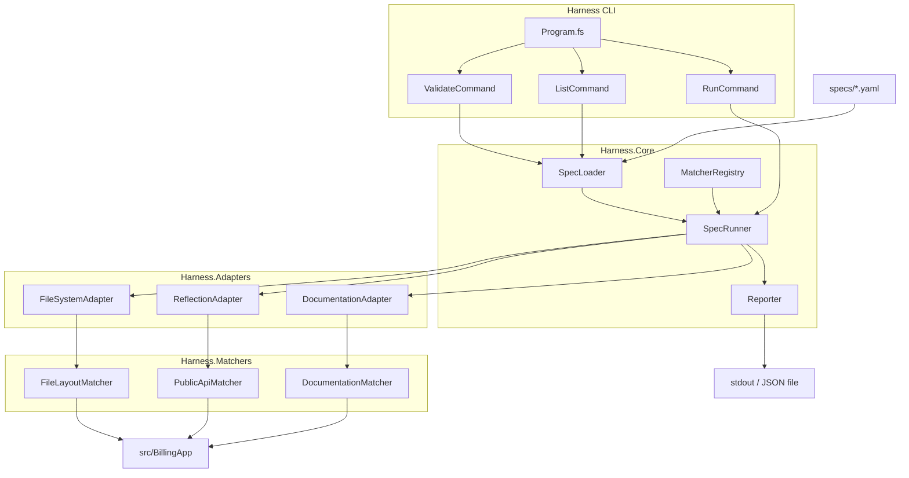
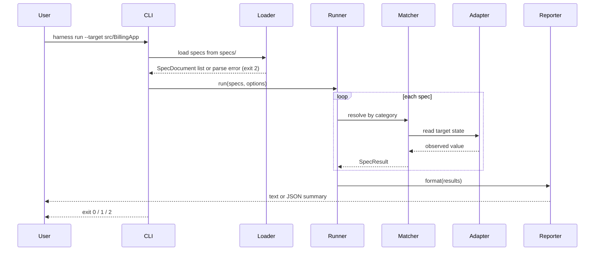

# Tech Spec: Spec-Driven Development Test Harness

**Status:** Draft  
**Last updated:** 2026-06-06  
**PRD:** [spec-driven-dev-test-harness.md](./spec-driven-dev-test-harness.md)

---

## 1. Purpose

This document translates the PRD into implementable design: types, interfaces, file layout, spec schema, CLI contract, and build/CI steps. It resolves PRD open questions with concrete v1 decisions.

---

## 2. Decisions (PRD §15 resolved)

| Question | v1 decision | Rationale |
|----------|-------------|-----------|
| Spec format | **YAML** on disk, validated against **JSON Schema** | Human-readable; schema gives machine validation |
| Target codebase | **Option A** — in-repo `BillingApp` F# library | Single toolchain; fastest path to green CI |
| Codebase explainer | **Out of scope for v1** | Harness only; adapter interface预留 for later |
| CI platform | **GitHub Actions** | Standard for OSS; `ubuntu-latest` + .NET 8 |
| Property-based specs | **Deferred to v2** | FsCheck hook noted in matcher registry; no v1 specs |

---

## 3. Technology Stack

| Layer | Choice | Version |
|-------|--------|---------|
| Language | F# | 8+ |
| Runtime | .NET | 8.0 |
| CLI parsing | `System.CommandLine` | 2.x |
| YAML | `YamlDotNet` | 16.x |
| JSON Schema validation | `NJsonSchema` | 11.x |
| Unit tests | `xUnit` + `Expecto` or xUnit only | xUnit 2.x |
| HTTP matcher (optional v1) | `System.Net.Http` | BCL |

**Target:** `BillingApp` — class library, no web host in v1. HTTP contract category uses a **fixture stub** or is deferred to M4.

---

## 4. System Architecture

### 4.1 Component diagram



### 4.2 Execution pipeline



### 4.3 Project structure

```
codebase-explainer.fsharp/
├── docs/
│   ├── spec-driven-dev-test-harness.md      # PRD
│   └── tech-spec-spec-driven-test-harness.md
├── specs/
│   ├── schema.json                          # JSON Schema for spec files
│   ├── file-layout.yaml
│   ├── public-api.yaml
│   └── documentation.yaml
├── src/
│   ├── Harness/
│   │   ├── Harness.fsproj
│   │   ├── Program.fs
│   │   ├── Cli/
│   │   │   ├── RunCommand.fs
│   │   │   ├── ValidateCommand.fs
│   │   │   └── ListCommand.fs
│   │   ├── Core/
│   │   │   ├── Types.fs
│   │   │   ├── SpecLoader.fs
│   │   │   ├── SpecRunner.fs
│   │   │   ├── MatcherRegistry.fs
│   │   │   └── Reporter.fs
│   │   ├── Adapters/
│   │   │   ├── ITargetAdapter.fs
│   │   │   ├── FileSystemAdapter.fs
│   │   │   ├── ReflectionAdapter.fs
│   │   │   └── DocumentationAdapter.fs
│   │   └── Matchers/
│   │       ├── IMatcher.fs
│   │       ├── FileLayoutMatcher.fs
│   │       ├── PublicApiMatcher.fs
│   │       └── DocumentationMatcher.fs
│   └── BillingApp/
│       ├── BillingApp.fsproj
│       └── Library.fs
├── tests/
│   └── Harness.Tests/
│       ├── Harness.Tests.fsproj
│       ├── SpecLoaderTests.fs
│       ├── MatcherTests.fs
│       └── Fixtures/
│           └── invalid-spec.yaml
├── .github/workflows/harness.yml
├── README.md
└── codebase-explainer.sln
```

---

## 5. Domain Model (F# Types)

### 5.1 Spec document

```fsharp
/// Harness/Core/Types.fs

type SpecVersion = string  // e.g. "1.0"

type SpecCategory =
    | FileLayout
    | PublicApi
    | Documentation
    | HttpContract  // registered but optional in v1

type Assertion =
    | FileExists of path: string
    | FileContains of path: string * substring: string
    | TypeExists of typeName: string
    | MemberExists of typeName: string * memberName: string * signature: string option
    | DocMentions of symbol: string

type SpecEntry =
    { Id: string
      Description: string
      Category: SpecCategory
      Tags: string list
      Assertion: Assertion }

type SpecDocument =
    { Version: SpecVersion
      Target: string              // relative path, e.g. "src/BillingApp"
      Entries: SpecEntry list }

type SpecStatus =
    | Passed
    | Failed
    | Skipped

type SpecResult =
    { Id: string
      Status: SpecStatus
      Message: string option
      Expected: string option
      Actual: string option
      DurationMs: int64 }

type RunSummary =
    { Total: int
      Passed: int
      Failed: int
      Skipped: int
      Results: SpecResult list }
```

### 5.2 Category string mapping

YAML `category` field maps to `SpecCategory`:

| YAML value | `SpecCategory` |
|------------|----------------|
| `file-layout` | `FileLayout` |
| `public-api` | `PublicApi` |
| `documentation` | `Documentation` |
| `http-contract` | `HttpContract` |

Unknown category → loader validation error (exit 2).

### 5.3 Assertion encoding in YAML

Assertions use a discriminated `type` field:

```yaml
assertion:
  type: file-exists
  path: README.md
```

```yaml
assertion:
  type: member-exists
  typeName: BillingApp.Calculator
  memberName: Add
  signature: "int -> int -> int"
```

---

## 6. Spec File Schema

### 6.1 Top-level document

| Field | Type | Required | Description |
|-------|------|----------|-------------|
| `version` | string | yes | Spec schema version (`"1.0"`) |
| `target` | string | yes | Path to codebase under test |
| `entries` | array | yes | List of spec entries |

### 6.2 Entry object

| Field | Type | Required | Description |
|-------|------|----------|-------------|
| `id` | string | yes | Stable identifier (kebab-case) |
| `description` | string | yes | Human-readable intent |
| `category` | string | yes | Matcher routing key |
| `tags` | string[] | no | Filters / grouping |
| `assertion` | object | yes | Category-specific payload |

### 6.3 Assertion types (v1)

| `type` | Fields | Matcher |
|--------|--------|---------|
| `file-exists` | `path` | `FileLayoutMatcher` |
| `file-contains` | `path`, `substring` | `FileLayoutMatcher` |
| `type-exists` | `typeName` | `PublicApiMatcher` |
| `member-exists` | `typeName`, `memberName`, `signature?` | `PublicApiMatcher` |
| `doc-mentions` | `symbol` | `DocumentationMatcher` |

Full JSON Schema lives at `specs/schema.json` (generated/maintained alongside `Types.fs`).

### 6.4 Example spec files

**`specs/file-layout.yaml`**

```yaml
version: "1.0"
target: src/BillingApp
entries:
  - id: readme-exists
    description: Repository documents how to run the harness
    category: file-layout
    tags: [docs, smoke]
    assertion:
      type: file-exists
      path: README.md

  - id: library-file-exists
    description: BillingApp implementation file is present
    category: file-layout
    tags: [billing-app]
    assertion:
      type: file-exists
      path: src/BillingApp/Library.fs
```

**`specs/public-api.yaml`**

```yaml
version: "1.0"
target: src/BillingApp
entries:
  - id: calculator-type-exists
    description: Calculator module is part of the public API
    category: public-api
    assertion:
      type: type-exists
      typeName: BillingApp.Calculator

  - id: calculator-add-signature
    description: Add accepts two integers and returns an integer
    category: public-api
    assertion:
      type: member-exists
      typeName: BillingApp.Calculator
      memberName: Add
      signature: "int -> int -> int"
```

**`specs/documentation.yaml`**

```yaml
version: "1.0"
target: src/BillingApp
entries:
  - id: readme-documents-calculator
    description: README mentions the Calculator API
    category: documentation
    assertion:
      type: doc-mentions
      symbol: Calculator
```

---

## 7. Core Interfaces

### 7.1 Matcher

```fsharp
/// Harness/Matchers/IMatcher.fs

type IMatcher =
    abstract Category: SpecCategory
    abstract Evaluate: entry: SpecEntry * targetRoot: string -> SpecResult
```

### 7.2 Target adapter

```fsharp
/// Harness/Adapters/ITargetAdapter.fs

type ITargetAdapter =
    abstract Name: string
    abstract Read: targetRoot: string -> Result<obj, string>
```

Adapters are composed per matcher (e.g. `ReflectionAdapter` loads assembly from `targetRoot` build output).

### 7.3 Matcher registry

```fsharp
/// Harness/Core/MatcherRegistry.fs

type MatcherRegistry =
    private { matchers: Map<SpecCategory, IMatcher> }

module MatcherRegistry =
    val createDefault: unit -> MatcherRegistry
    val resolve: registry: MatcherRegistry -> category: SpecCategory -> IMatcher option
```

Registration is static in v1 (no reflection/DLL plugins):

```fsharp
let createDefault () =
    [ FileLayoutMatcher() :> IMatcher
      PublicApiMatcher() :> IMatcher
      DocumentationMatcher() :> IMatcher ]
    |> List.map (fun m -> m.Category, m)
    |> Map.ofList
    |> fun m -> { matchers = m }
```

---

## 8. Component Specifications

### 8.1 SpecLoader

**Responsibilities**

- Discover `*.yaml` under `specs/` (recursive optional: v1 non-recursive, top-level only)
- Parse YAML → DTO → validate against `specs/schema.json`
- Map DTO → `SpecDocument` / `SpecEntry` / `Assertion`
- Deduplicate `id` across files; duplicate → error

**API**

```fsharp
module SpecLoader =
    val loadDirectory: specsDir: string -> Result<SpecEntry list, string>
    val loadFile: path: string -> Result<SpecDocument, string>
    val validateOnly: specsDir: string -> Result<unit, string>
```

**Errors** return `Error` with file path and line context when YamlDotNet provides it.

### 8.2 SpecRunner

**Responsibilities**

- Accept flattened `SpecEntry list` + `RunOptions`
- Resolve matcher per entry; unknown category → `Skipped` with message (or fail in strict mode; v1: **Failed**)
- Catch exceptions per entry; never abort batch
- Honor `--fail-fast`: stop scheduling new entries after first failure (in-flight complete)

**API**

```fsharp
type RunOptions =
    { TargetOverride: string option
      SpecFilter: string option      // single file
      IdFilter: string list option   // --id
      FailFast: bool
      TagFilter: string list option }

module SpecRunner =
    val run: entries: SpecEntry list * registry: MatcherRegistry * options: RunOptions -> RunSummary
```

**Target path resolution:** `entry` inherits `target` from its parent `SpecDocument`; runner passes `targetRoot` to matcher.

### 8.3 Matchers (v1 behavior)

#### FileLayoutMatcher

| Assertion | Algorithm | Expected | Actual |
|-----------|-----------|----------|--------|
| `file-exists` | `Path.Combine(repoRoot, path)` exists | path | "missing" or path |
| `file-contains` | Read file UTF-8, `Contains substring` | substring | excerpt or "not found" |

`repoRoot` = current working directory (CLI sets cwd to repo root).

#### PublicApiMatcher

1. Build `BillingApp` via `dotnet build` or load pre-built DLL from `src/BillingApp/bin/Debug/net8.0/BillingApp.dll`
2. `ReflectionOnlyLoadFrom` / `Assembly.LoadFrom` (implementation choice: **LoadFrom** after build)
3. `type-exists`: `assembly.GetType(typeName)` ≠ null
4. `member-exists`: resolve method/property; compare `signature` to F# formatted type string if provided

**Build step:** Runner invokes `dotnet build src/BillingApp/BillingApp.fsproj -v q` once per run if DLL missing or older than source.

#### DocumentationMatcher

| Assertion | Algorithm |
|-----------|-----------|
| `doc-mentions` | Read `README.md`; case-insensitive contains `symbol` |

### 8.4 Reporter

**Text format (default)**

```
Spec Results (3 passed, 1 failed, 0 skipped)

ID                         STATUS   TIME     MESSAGE
readme-exists              PASS     12ms
calculator-add-signature   FAIL     45ms     Signature mismatch
  expected: int -> int -> int
  actual:   int -> int -> int64
```

Plain text when stdout is not a TTY (CI). Optional ANSI colors when TTY.

**JSON format** (`--format json`)

```json
{
  "total": 4,
  "passed": 3,
  "failed": 1,
  "skipped": 0,
  "results": [
    {
      "id": "calculator-add-signature",
      "status": "failed",
      "message": "Signature mismatch",
      "expected": "int -> int -> int",
      "actual": "int -> int -> int64",
      "durationMs": 45
    }
  ]
}
```

---

## 9. CLI Contract

### 9.1 Entry point

```bash
dotnet run --project src/Harness -- [command] [options]
```

Binary name after pack: `harness` (optional; v1 uses `dotnet run`).

### 9.2 Commands

| Command | Description |
|---------|-------------|
| `run` | Load specs, execute matchers, emit report (default) |
| `validate` | Parse + schema-validate only |
| `list` | Print registered spec ids and categories |

### 9.3 Options (global + run)

| Flag | Applies to | Description |
|------|------------|-------------|
| `--specs-dir <path>` | all | Default: `specs` |
| `--spec <file>` | run, list | Single spec file |
| `--format text\|json` | run | Default: `text` |
| `--output <file>` | run | Write report to file |
| `--fail-fast` | run | Stop after first failure |
| `--target <path>` | run | Override document `target` |
| `--tag <tag>` | run | Run entries with tag only (repeatable) |
| `--id <id>` | run | Run single entry id (repeatable) |

### 9.4 Exit codes

| Code | Meaning |
|------|---------|
| `0` | Success (all pass, or validate/list ok) |
| `1` | One or more spec failures |
| `2` | Harness error (parse, schema, I/O, build failure) |

### 9.5 Examples

```bash
# Full run
dotnet run --project src/Harness -- run

# CI JSON report
dotnet run --project src/Harness -- run --format json --output harness-report.json

# Validate spec syntax only
dotnet run --project src/Harness -- validate

# Filter by tag
dotnet run --project src/Harness -- run --tag smoke
```

---

## 10. BillingApp (Target)

Minimal F# library for demonstration.

**`src/BillingApp/Library.fs`**

```fsharp
namespace BillingApp

module Calculator =
    let Add (a: int) (b: int) : int = a + b

    let Subtract (a: int) (b: int) : int = a - b

module Greeter =
    let Hello (name: string) : string = $"Hello, {name}!"
```

**Demo failure fixture:** `tests/Harness.Tests/Fixtures/` includes a spec expecting wrong signature; integration test asserts `Failed` result shape.

Optional intentional failure spec in `specs/demo-failure.yaml` (tag `demo-only`, excluded from CI via `--tag smoke` or separate CI step). **CI runs smoke tags only**; local README shows full run with one failure.

---

## 11. Error Handling

| Scenario | Behavior | Exit |
|----------|----------|------|
| Invalid YAML | Report file + parse error | 2 |
| Schema validation fail | Report path + JSON Schema message | 2 |
| Duplicate spec `id` | List conflicting files | 2 |
| Target path missing | Fail before run | 2 |
| `dotnet build` fails | Capture stderr in message | 2 |
| Matcher throws | Entry `Failed`, message = exception message | 1 |
| Assertion not satisfied | Entry `Failed` with expected/actual | 1 |

All errors use `Result<'T, string>` internally; CLI maps to exit codes.

---

## 12. Testing Strategy

### 12.1 Harness.Tests (unit)

| Test suite | Covers |
|------------|--------|
| `SpecLoaderTests` | Valid YAML, invalid YAML, schema violations, duplicate ids |
| `FileLayoutMatcherTests` | exists / contains with temp directories |
| `PublicApiMatcherTests` | Load BillingApp DLL, type/member checks |
| `DocumentationMatcherTests` | README fixture with/without symbol |
| `ReporterTests` | JSON snapshot, text columns |
| `SpecRunnerTests` | fail-fast, tag filter, exception isolation |

### 12.2 Integration

- End-to-end: run CLI against temp repo fixture (copy `specs/` + minimal tree)
- CI: `dotnet test` then `harness run --tag smoke`

### 12.3 Coverage target

- `SpecLoader`, `MatcherRegistry`, `SpecRunner`, all v1 matchers: **≥ 80%** line coverage (guideline, not enforced by tool in M1)

---

## 13. CI Pipeline

**`.github/workflows/harness.yml`**

```yaml
name: Harness

on:
  push:
    branches: [main]
  pull_request:

jobs:
  verify:
    runs-on: ubuntu-latest
    steps:
      - uses: actions/checkout@v4
      - uses: actions/setup-dotnet@v4
        with:
          dotnet-version: "8.0.x"
      - run: dotnet restore
      - run: dotnet build --no-restore
      - run: dotnet test --no-build --verbosity normal
      - run: dotnet run --project src/Harness -- validate
      - run: dotnet run --project src/Harness -- run --tag smoke --format json --output harness-report.json
      - uses: actions/upload-artifact@v4
        if: always()
        with:
          name: harness-report
          path: harness-report.json
```

---

## 14. Dependencies (`Harness.fsproj`)

```xml
<ItemGroup>
  <PackageReference Include="System.CommandLine" Version="2.*" />
  <PackageReference Include="YamlDotNet" Version="16.*" />
  <PackageReference Include="NJsonSchema" Version="11.*" />
</ItemGroup>
```

`Harness` does not reference `BillingApp` at compile time; reflection loads built output at runtime.

---

## 15. Implementation Order

| Step | Deliverable | PRD milestone |
|------|-------------|---------------|
| 1 | Solution + projects + `Types.fs` | M1 |
| 2 | `specs/schema.json` + loader + `validate` | M1 |
| 3 | `FileLayoutMatcher` + `file-layout.yaml` | M1 |
| 4 | `BillingApp` + `PublicApiMatcher` | M2 |
| 5 | `run` command + text `Reporter` | M2 |
| 6 | `Harness.Tests` for loader + matchers | M2 |
| 7 | `DocumentationMatcher` + JSON reporter | M3 |
| 8 | `--fail-fast`, `--tag`, `--format json` | M3 |
| 9 | GitHub Actions workflow | M3 |
| 10 | README quick start + SDD loop | M3 |

---

## 16. Extension Points (post-v1)

| Extension | Mechanism |
|-----------|-----------|
| New matcher | Implement `IMatcher`, add to `MatcherRegistry.createDefault` |
| New assertion `type` | Extend JSON Schema + `Assertion` DU + matcher branch |
| External repo target | `FileSystemAdapter` accepts absolute `--target`; document cwd rules |
| HTTP contract | `HttpContractMatcher` + spawn test server or TestServer |
| Property tests | `property` assertion type + FsCheck in v2 |
| JUnit XML | Add `Reporter.formatJUnit` for CI dashboards (P1) |

---

## 17. Acceptance Checklist (maps to PRD §16)

- [ ] `dotnet run --project src/Harness -- run` evaluates all specs against `BillingApp`
- [ ] Demo failure spec shows expected vs actual in text and JSON output
- [ ] `dotnet test` green for `Harness.Tests`
- [ ] `validate` catches invalid fixture in `tests/Harness.Tests/Fixtures/invalid-spec.yaml`
- [ ] CI workflow passes on clean clone; fails when smoke spec broken
- [ ] README links to PRD + this tech spec

---

## Appendix A: Matcher ↔ Adapter matrix

| Matcher | Adapter(s) | Source of truth |
|---------|------------|-----------------|
| `FileLayoutMatcher` | `FileSystemAdapter` | OS filesystem |
| `PublicApiMatcher` | `ReflectionAdapter` | Built `BillingApp.dll` |
| `DocumentationMatcher` | `DocumentationAdapter` | `README.md` |

## Appendix B: F# signature formatting

For `member-exists` signature comparison, normalize:

- Trim whitespace
- Lowercase generic parameter names for comparison only
- Format F# method as `arg1Type -> arg2Type -> returnType` via `FSharpType` reflection

Document limitations (operators, generics) in README; v1 supports simple module functions only.
